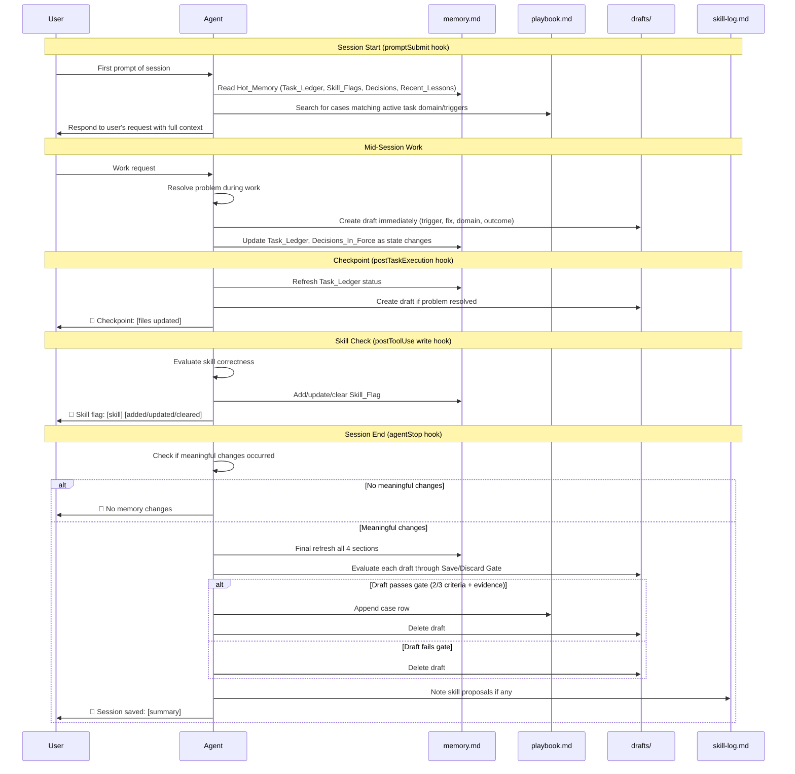
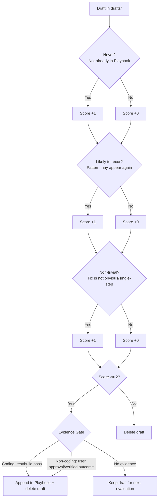

# Design Document — Agent Memory System

## Overview

The Agent Memory System provides cross-domain persistent memory for the `.claude` workspace agent. It is a **markdown-only system** — no code, no scripts, no database. The deliverables are:

1. **Markdown file templates** — structured templates for `memory.md`, `playbook.md`, `skill-log.md`, draft files, and knowledge detail files
2. **Kiro hook files** — 4 `.kiro.hook` JSON files that automate memory operations on IDE events
3. **Steering rule updates** — updating the existing `agent-memory-self-improve.md` to align with the new file structure

The system follows Karpathy's Simplicity First principle: lean base files, no speculative abstractions, minimum viable structure that works across all skill domains (AIDLC-governed coding, non-coding, and system/meta skills).

### Design Rationale

The previous memory system (`palace/` + `knowledge/`) used a scattered structure with separate state, search index, user profile, and nested lesson directories. The new design consolidates into a flat, purpose-driven layout:

- **One hot file** (`memory.md`) instead of three palace files
- **One flat table** (`playbook.md`) instead of nested lesson directories
- **One append-only log** (`skill-log.md`) instead of evolution.md + scattered entries
- **Drafts as ephemeral gate** — temporary files that get evaluated and either promoted or deleted
- **Knowledge as optional overflow** — detail files only when 120 chars isn't enough

## Architecture

### Directory Structure

```text
.claude/
├── agent-memory/
│   ├── memory.md              ← Hot_Memory (2.5KB max, loaded first)
│   ├── playbook.md            ← Flat searchable problem resolution table
│   ├── skill-log.md           ← Append-only skill improvement log
│   ├── drafts/                ← Ephemeral resolution drafts (pre-gate)
│   │   └── {YYYY-MM-DD}-{slug}.md
│   └── knowledge/             ← Optional detail files (on-demand load)
│       └── {YYYY-MM-DD}-{slug}.md
├── .kiro/
│   ├── hooks/                 ← Memory automation hooks
│   │   ├── agent-memory-session-load.kiro.hook
│   │   ├── agent-memory-checkpoint.kiro.hook
│   │   ├── agent-memory-session-save.kiro.hook
│   │   └── agent-memory-skill-check.kiro.hook
│   └── steering/
│       └── agent-memory-self-improve.md  ← Updated steering rules
└── rules/
    └── agent-core.md          ← Existing (unchanged, referenced)
```

### Session Flow



### Save/Discard Gate Flow



## Components and Interfaces

This system has no code components. The "components" are markdown file templates and hook configuration files. Each component is described by its template structure and the rules governing its content.

### Component 1: Hot Memory File (`memory.md`)

**Purpose**: Single compact file loaded first at every session start. Contains the 4 most critical memory sections.

**Size constraint**: 2,500 bytes maximum.

**Template**:

```markdown
# Agent Memory — Hot State

## Task_Ledger

<!-- Max 5 entries. Format: Coding = system/feature/phase/status | Non-Coding = domain/goal/status -->
<!-- Mark stale after 3 sessions without update. Remove oldest stale when full. -->

| # | Type | Entry | Last Updated |
|---|------|-------|--------------|
| 1 | coding | webUi/auth-flow/phase-3/in-progress | 2025-01-15 |
| 2 | non-coding | finance/q1-tax-review/active | 2025-01-14 |

## Recent_Lessons

<!-- Last 5 lesson IDs only. Detail lives in playbook.md or knowledge/. -->

- CASE-012 — Playwright: `getByTestId` over `getByRole` for dynamic lists
- CASE-011 — Thai tax: withholding tax 3% applies to service invoices > 1000 THB

## Skill_Flags

<!-- Max 5 entries. Remove when 3 consecutive successes. -->

| Skill | Domain | Failure | Flagged | Successes |
|-------|--------|---------|---------|-----------|
| qa/playwright-testing | coding | Flaky locator strategy | 2025-01-14 | 1/3 |

## Decisions_In_Force

<!-- Active decisions that persist across sessions. Remove when superseded. -->

- **2025-01-15**: Use `getByTestId` as primary locator strategy for all Playwright tests
- **2025-01-13**: Thai accounting uses cash basis, not accrual basis
```

**Rules**:
- Task_Ledger entries use pipe-delimited format: `system/feature/phase/status` for coding, `domain/goal/status` for non-coding
- Coding tasks reference `.aidlc/` path but do NOT duplicate PROGRESS.md content
- Non-coding tasks have NO `.aidlc/` folder — domain and goal recorded directly
- Stale = not updated for 3 consecutive sessions
- When full (5 entries) and new task arrives: remove oldest stale entry; if none stale, prompt user to archive one
- Recent_Lessons holds IDs + one-line summaries only (not full content)
- Decisions_In_Force entries include date and concise decision statement

### Component 2: Playbook (`playbook.md`)

**Purpose**: Flat, searchable table of resolved problems across all domains.

**Template**:

```markdown
# Playbook — Problem Resolution Cases

<!-- Flat table. Search by domain or trigger keywords. -->
<!-- Trigger/Fix: 120 chars max. If more detail needed, add file path to knowledge/. -->

| ID | Trigger | Fix | Domain | Outcome |
|----|---------|-----|--------|---------|
| CASE-001 | Playwright test flaky on dynamic list | Switch from getByRole to getByTestId with stable data-testid | coding/qa | Tests stable, no flakes in 10 runs |
| CASE-002 | WHT 3% not applied to service invoice | Add withholding tax check when invoice type=service AND amount>1000 | thai-accountant | Tax calc correct, verified with RD rules |
| CASE-003 | Portfolio beta calc wrong for SET stocks | Use SET index as benchmark instead of S&P500 for Thai stocks. See [knowledge/2025-01-10-set-beta.md] | finance | Beta values match Bloomberg terminal |
```

**Rules**:
- Sequential IDs: `CASE-001`, `CASE-002`, etc.
- Trigger and Fix fields: 120 characters max each
- When detail exceeds 120 chars: store in `knowledge/{YYYY-MM-DD}-{slug}.md` and reference the path in the row
- Domain-agnostic: same schema for all domains (coding, finance, fitness, accounting, system)
- Searched at session start when Task_Ledger has active tasks (match by domain or trigger keywords)

### Component 3: Skill Log (`skill-log.md`)

**Purpose**: Append-only record of all skill improvement proposals and their outcomes.

**Template**:

```markdown
# Skill Log — Improvement Proposals

<!-- Append-only. Never delete entries. Status: proposed → approved → applied | rejected -->

| Date | Skill | Problem | Proposed Change | Status |
|------|-------|---------|-----------------|--------|
| 2025-01-15 | qa/playwright-testing | Flaky locators on dynamic content | Add rule: prefer getByTestId for lists with dynamic content | applied |
| 2025-01-14 | finance/stock-deep-analysis | Beta calc used wrong benchmark | Add rule: use local index for local stocks | proposed |
```

**Rules**:
- Append-only: entries are never deleted, only status changes
- Status lifecycle: `proposed` → `approved` → `applied` (or `proposed` → `rejected`)
- Max 1 proposal per skill per session (prevents proposal spam)
- Requires explicit user approval before applying changes to any SKILL.md file
- Accepts entries from all skill types: `ai-dlc/*`, `finance/*`, `fitness/*`, `thai-accountant/*`, `system/*`

### Component 4: Draft Files (`drafts/{YYYY-MM-DD}-{slug}.md`)

**Purpose**: Temporary resolution captures created immediately when problems are resolved. Evaluated by Save/Discard Gate before session end.

**Template**:

```markdown
# Draft: {short description}

**Trigger**: {what went wrong — the problem pattern}
**Fix**: {what resolved it — the solution}
**Domain**: {skill domain, e.g., coding/qa, finance, thai-accountant}
**Outcome**: {result after fix applied}
```

**Rules**:
- Created immediately upon resolution, not deferred to session end
- Filename: `{YYYY-MM-DD}-{short-slug}.md` (e.g., `2025-01-15-flaky-locator.md`)
- Domain-agnostic format: same 4 fields for all problem types
- Ephemeral: deleted after Save/Discard Gate evaluation (pass or fail)
- If `drafts/` directory doesn't exist, create it before writing

### Component 5: Knowledge Detail Files (`knowledge/{YYYY-MM-DD}-{slug}.md`)

**Purpose**: Optional overflow for Playbook entries that need more than 120 characters of detail.

**Template**:

```markdown
# {Title}

**Case**: CASE-{NNN}
**Domain**: {domain}
**Date**: {YYYY-MM-DD}

## Problem

{Detailed description of what went wrong}

## Resolution

{Detailed step-by-step fix}

## Evidence

{Test results, user confirmation, or verified outcome}
```

**Rules**:
- NOT auto-loaded at session start (on-demand only)
- Loaded only when a matching Playbook case is relevant to the current task
- Filename: `{YYYY-MM-DD}-{short-slug}.md`
- Created only when a Playbook entry needs more detail than 120 chars
- If `knowledge/` directory doesn't exist, create it only when needed

### Component 6: Hook Files (`.kiro/hooks/`)

Four hooks automate the memory lifecycle. Each is a `.kiro.hook` JSON file.

#### Hook 1: Session Load (`agent-memory-session-load.kiro.hook`)

- **Event**: `promptSubmit` (first prompt only)
- **Action**: `askAgent`
- **Behavior**: Read `memory.md` → search `playbook.md` for matching cases → proceed with user's request
- **Constraint**: Does NOT block user's request. Does NOT re-trigger on subsequent prompts.

```json
{
  "name": "Agent Memory — Session Load",
  "version": "1.0.0",
  "description": "Load agent memory on first prompt of session. Reads memory.md and searches playbook.md for relevant cases.",
  "when": {
    "type": "promptSubmit"
  },
  "then": {
    "type": "askAgent",
    "prompt": "This is the first message of the session. Before responding, read agent-memory/memory.md for current task context, decisions, skill flags, and recent lessons. If the Task_Ledger has active tasks, search agent-memory/playbook.md for cases with matching domain or trigger keywords. Then proceed with the user's request. Do NOT re-read memory on subsequent prompts in this session."
  }
}
```

#### Hook 2: Mid-Session Checkpoint (`agent-memory-checkpoint.kiro.hook`)

- **Event**: `postTaskExecution`
- **Action**: `askAgent`
- **Behavior**: Update `memory.md` (Task_Ledger + Decisions_In_Force) → create draft if problem resolved → report to user

```json
{
  "name": "Agent Memory — Mid-Session Checkpoint",
  "version": "1.0.0",
  "description": "After each spec task completes, checkpoint memory state so progress survives session interruptions.",
  "when": {
    "type": "postTaskExecution"
  },
  "then": {
    "type": "askAgent",
    "prompt": "A task just completed. Checkpoint agent memory: 1) Update agent-memory/memory.md — refresh Task_Ledger entry for the completed task and update Decisions_In_Force if any decisions were made. 2) If a problem was resolved during this task, create a draft in agent-memory/drafts/ with trigger, fix, domain, and outcome. 3) Report to user: 📝 Checkpoint: [list of files updated]."
  }
}
```

#### Hook 3: Session Save (`agent-memory-session-save.kiro.hook`)

- **Event**: `agentStop`
- **Action**: `askAgent`
- **Behavior**: Check for meaningful changes → if none, skip → if yes, final sweep: update `memory.md`, evaluate drafts through Save/Discard Gate, append passing cases to `playbook.md`, note skill proposals in `skill-log.md` → report summary

```json
{
  "name": "Agent Memory — Session Save",
  "version": "1.0.0",
  "description": "Final memory sweep at session end. Evaluates drafts, updates playbook, and reports summary.",
  "when": {
    "type": "agentStop"
  },
  "then": {
    "type": "askAgent",
    "prompt": "Check if this session produced meaningful state changes (task progress, new decisions, problem resolutions, or skill flags). If the session was only Q&A, comparison, research, or exploration without decisions — skip saving and report: 📝 No memory changes. If meaningful changes occurred: 1) Update agent-memory/memory.md — final refresh of Task_Ledger, Decisions_In_Force, Recent_Lessons, and Skill_Flags. 2) Evaluate all files in agent-memory/drafts/ through the Save/Discard Gate (novel + recur + non-trivial, 2/3 = save). 3) For passing drafts: append to agent-memory/playbook.md and delete the draft. For failing drafts: delete the draft. 4) If any Skill_Flag has sufficient evidence, note a proposal in agent-memory/skill-log.md. 5) Report to user: 📝 Session saved: [list of files updated, cases added/discarded, proposals noted]."
  }
}
```

#### Hook 4: Skill Flag Check (`agent-memory-skill-check.kiro.hook`)

- **Event**: `postToolUse` (write tool types)
- **Action**: `askAgent`
- **Behavior**: Evaluate if skill produced correct result → if not, add/update Skill_Flag → if already flagged and success, increment counter → if counter reaches 3, clear flag → report changes

```json
{
  "name": "Agent Memory — Skill Flag Check",
  "version": "1.0.0",
  "description": "After write operations, check if the skill used produced correct results. Flag underperforming skills.",
  "when": {
    "type": "postToolUse",
    "toolTypes": ["write"]
  },
  "then": {
    "type": "askAgent",
    "prompt": "After this write operation, briefly evaluate: did the skill used produce the correct result? If the output has errors, incorrect logic, or required significant rework, add or update a Skill_Flag entry in agent-memory/memory.md with the skill path, domain, and failure description. If the skill is already flagged and this was a success, increment its success counter. If success counter reaches 3, remove the flag. Report any flag changes to user: 📝 Skill flag: [skill] [added/updated/cleared]."
  }
}
```

### Component 7: Updated Steering Rules

The existing `.kiro/steering/agent-memory-self-improve.md` must be updated to replace the old `palace/` + `knowledge/lessons/` structure with the new flat layout.

**Key changes**:
- Replace `palace/state.md` references → `agent-memory/memory.md`
- Replace `palace/search-index.md` → removed (playbook.md is the search surface)
- Replace `palace/user-profile.md` → removed (user preferences go in Decisions_In_Force)
- Replace `knowledge/lessons/{domain}/` → `agent-memory/knowledge/` (flat, no domain subdirs)
- Replace `knowledge/evolution.md` → `agent-memory/skill-log.md`
- Replace `knowledge/index.md` → removed (playbook.md serves as the index)
- Update size constraint: `state.md` 3,000 chars → `memory.md` 2,500 bytes
- Add Save/Discard Gate rules for mid-session writes
- Add draft creation rules
- Remove references to deleted files (`graph.md`, `tunnels.md`, `archive/`)

**Updated steering content**:

```markdown
---
inclusion: auto
---

# Agent Memory — Self-Improve Rules

You have persistent memory files that you can write to **at any time during a session**.

## Memory Location

agent-memory/
├── memory.md        ← Hot state (2.5KB max, loaded first)
├── playbook.md      ← Flat problem resolution table
├── skill-log.md     ← Append-only skill improvement log
├── drafts/          ← Temporary resolution drafts (ephemeral)
└── knowledge/       ← Optional detail files (on-demand)

## When to Write Mid-Session

Write immediately when:
1. **Problem resolved** → create draft in `agent-memory/drafts/`
2. **Task status changed** → update Task_Ledger in `memory.md`
3. **Decision made** → add to Decisions_In_Force in `memory.md`
4. **Skill underperformed** → add Skill_Flag in `memory.md`
5. **Skill flag cleared** (3 successes) → remove from `memory.md`

## Save/Discard Gate (for drafts)

Before promoting a draft to playbook.md, evaluate 3 criteria:
- **Novel**: not already covered by an existing case
- **Likely to recur**: the problem pattern may appear again
- **Non-trivial**: the fix is not obvious or single-step

Score >= 2/3 → proceed to Evidence Gate.
Score < 2/3 → delete the draft.

Evidence Gate:
- Coding: test pass or build pass required
- Non-coding: user approval or verified outcome required

## Bounded State

If `memory.md` exceeds 2,500 bytes → consolidate before adding:
- Remove oldest stale Task_Ledger entry
- Remove lowest-priority Skill_Flag (most successes since flagging)
- Trim Recent_Lessons to 5 entries

## What NOT to Create

Do NOT create: `palace/`, `graph.md`, `tunnels.md`, `archive/`,
`search-index.md`, `user-profile.md`, `evolution.md`, `index.md`,
or any subdirectories within `agent-memory/` beyond `drafts/` and `knowledge/`.
```

## Data Models

This system uses no database. All data is stored as structured markdown. The "data models" are the markdown table schemas and section formats.

### Model 1: Task_Ledger Entry

| Field | Type | Constraints | Example |
|-------|------|-------------|---------|
| # | integer | 1-5, sequential | `1` |
| Type | enum | `coding` or `non-coding` | `coding` |
| Entry | string | Coding: `system/feature/phase/status`; Non-coding: `domain/goal/status` | `webUi/auth-flow/phase-3/in-progress` |
| Last Updated | date | `YYYY-MM-DD` format | `2025-01-15` |

**Constraints**: Max 5 entries. Stale after 3 sessions without update.

### Model 2: Playbook Case Row

| Field | Type | Constraints | Example |
|-------|------|-------------|---------|
| ID | string | `CASE-{NNN}`, sequential from 001 | `CASE-001` |
| Trigger | string | Max 120 characters | `Playwright test flaky on dynamic list` |
| Fix | string | Max 120 characters | `Switch from getByRole to getByTestId` |
| Domain | string | Free-form domain path | `coding/qa` |
| Outcome | string | Max 120 characters | `Tests stable, no flakes in 10 runs` |

**Overflow**: When Trigger or Fix exceeds 120 chars, store detail in `knowledge/` and reference the file path.

### Model 3: Skill_Flag Entry

| Field | Type | Constraints | Example |
|-------|------|-------------|---------|
| Skill | string | Skill path from skill map | `qa/playwright-testing` |
| Domain | string | Skill domain category | `coding` |
| Failure | string | Brief failure description | `Flaky locator strategy` |
| Flagged | date | `YYYY-MM-DD` | `2025-01-14` |
| Successes | string | `N/3` format (counter toward clearing) | `1/3` |

**Constraints**: Max 5 entries. Cleared at 3/3 successes. When full, replace entry with most successes.

### Model 4: Skill_Log Entry

| Field | Type | Constraints | Example |
|-------|------|-------------|---------|
| Date | date | `YYYY-MM-DD` | `2025-01-15` |
| Skill | string | Skill path | `qa/playwright-testing` |
| Problem | string | Brief problem summary | `Flaky locators on dynamic content` |
| Proposed Change | string | What to change in SKILL.md | `Add rule: prefer getByTestId for lists` |
| Status | enum | `proposed`, `approved`, `applied`, `rejected` | `applied` |

**Constraints**: Append-only. Max 1 proposal per skill per session.

### Model 5: Draft File

| Field | Type | Constraints | Example |
|-------|------|-------------|---------|
| Trigger | string | What went wrong | `WHT 3% not applied to service invoice` |
| Fix | string | What resolved it | `Add withholding tax check for service > 1000` |
| Domain | string | Skill domain | `thai-accountant` |
| Outcome | string | Result after fix | `Tax calc correct per RD rules` |

**Constraints**: Ephemeral. Filename: `{YYYY-MM-DD}-{short-slug}.md`. Deleted after gate evaluation.

### Model 6: Decisions_In_Force Entry

| Field | Type | Constraints | Example |
|-------|------|-------------|---------|
| Date | date | `YYYY-MM-DD` | `2025-01-15` |
| Decision | string | Concise decision statement | `Use getByTestId as primary locator strategy` |

**Constraints**: Remove when superseded by a newer decision. No max count (bounded by 2.5KB file limit).

## Error Handling

Since this is a markdown-only system with no runtime code, "error handling" means defining agent behavior when expected conditions aren't met.

| Condition | Agent Behavior |
|-----------|---------------|
| `memory.md` doesn't exist at session start | Create it with empty four-section template (Req 1.4) |
| `drafts/` directory doesn't exist | Create it before writing a draft (Req 5.5) |
| `knowledge/` directory doesn't exist | Create it only when a Playbook entry needs a detail file (Req 9.6) |
| `memory.md` exceeds 2,500 bytes | Consolidate: remove oldest stale entry or lowest-priority Skill_Flag (Req 1.3) |
| Task_Ledger full (5 entries), all active | Prompt user to select which entry to archive (Req 2.4) |
| Task_Ledger full (5 entries), some stale | Remove oldest stale entry automatically (Req 2.3) |
| Skill_Flags full (5 entries), new flag needed | Replace entry with most consecutive successes since flagging (Req 3.5) |
| Draft fails Save/Discard Gate (< 2/3 criteria) | Delete the draft file (Req 6.3) |
| Draft passes criteria but no evidence yet | Keep draft for next evaluation cycle (coding: need test/build pass; non-coding: need user approval) |
| Playbook entry needs > 120 chars | Create knowledge detail file and reference path in Playbook row (Req 7.7) |
| Agent writes to `.aidlc/` during memory ops | VIOLATION — memory ops must never write to `.aidlc/` (Req 8.2) |
| Session has no meaningful changes | Skip save entirely, report "📝 No memory changes" (Req 10.3) |
| Secrets/PII detected in memory content | Do NOT store — strip before writing (Req 8.3) |

## Testing Strategy

### Why Property-Based Testing Does Not Apply

This feature produces **markdown file templates, JSON hook configurations, and steering rule documents**. There are no functions, no parsers, no serializers, no algorithms, and no code with input/output behavior. The deliverables are static file content that the agent follows as behavioral rules. PBT requires universally quantified properties over varying inputs — this system has no such input space.

### Verification Approach

Since this is a markdown-only system, verification is structural and behavioral:

**1. Template Validation (Manual Review)**
- Each markdown template renders correctly in VS Code / GitHub preview
- Table columns align and are parseable
- Section headers match the expected four-section structure in `memory.md`
- Hook JSON files are valid JSON and match the Kiro hook schema

**2. Hook Configuration Verification**
- Each `.kiro.hook` file has valid JSON syntax
- Event types match Kiro's supported events: `promptSubmit`, `postTaskExecution`, `agentStop`, `postToolUse`
- `toolTypes` field uses valid values (`write`)
- Prompt text in each hook accurately describes the expected agent behavior

**3. Constraint Verification (Checklist)**
- [ ] `memory.md` template is under 2,500 bytes when populated with example data
- [ ] Task_Ledger shows max 5 entries in template
- [ ] Skill_Flags shows max 5 entries in template
- [ ] Recent_Lessons shows max 5 entries in template
- [ ] Playbook Trigger/Fix fields are under 120 characters in examples
- [ ] Draft filename follows `{YYYY-MM-DD}-{short-slug}.md` pattern
- [ ] Knowledge filename follows `{YYYY-MM-DD}-{short-slug}.md` pattern
- [ ] All memory files are within `agent-memory/` directory
- [ ] No subdirectories beyond `drafts/` and `knowledge/`
- [ ] Hook files are in `.kiro/hooks/` directory

**4. Integration Smoke Test (Manual)**
- Start a new session → verify session-load hook triggers and reads `memory.md`
- Complete a spec task → verify checkpoint hook updates `memory.md`
- End a session → verify session-save hook evaluates drafts and updates playbook
- Perform a write operation → verify skill-check hook evaluates skill correctness

**5. Steering Rule Consistency Check**
- Updated `agent-memory-self-improve.md` references only files that exist in the new structure
- No references to removed files (`palace/`, `graph.md`, `tunnels.md`, `search-index.md`, etc.)
- Size constraints match: 2,500 bytes for `memory.md`
- Save/Discard Gate criteria match requirements (2/3 threshold)
