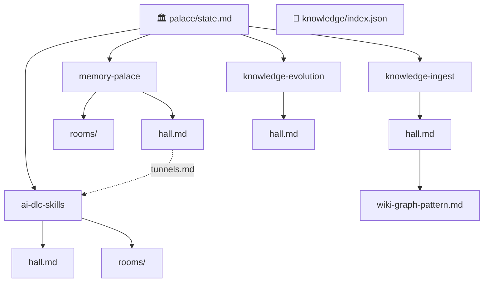

# 🗺️ Unified Memory Palace — Graph

```mermaid
graph TD
    %% Global Root
    State[🏛️ palace/state.md]
    KnowledgeIndex[🧠 knowledge/index.json]
    
    %% Wings
    State --> W_AIDLC[ai-dlc-skills]
    State --> W_MP[memory-palace]
    State --> W_KI[knowledge-ingest]
    State --> W_KE[knowledge-evolution]

    %% Wing Contents
    W_AIDLC --> AIDLC_Hall[hall.md]
    W_AIDLC --> AIDLC_Rooms[rooms/]
    
    W_MP --> MP_Hall[hall.md]
    W_MP --> MP_Rooms[rooms/]
    
    W_KI --> KI_Hall[hall.md]
    KI_Hall --> KI_Wiki[wiki-graph-pattern.md]
    
    W_KE --> KE_Hall[hall.md]

    %% Connections (Tunnels)
    MP_Hall -.->|tunnels.md| W_AIDLC
```

> Generated on 2026-04-18 via `unified-memory` system audit.
