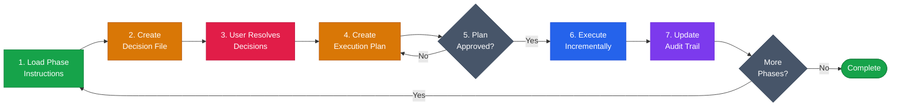
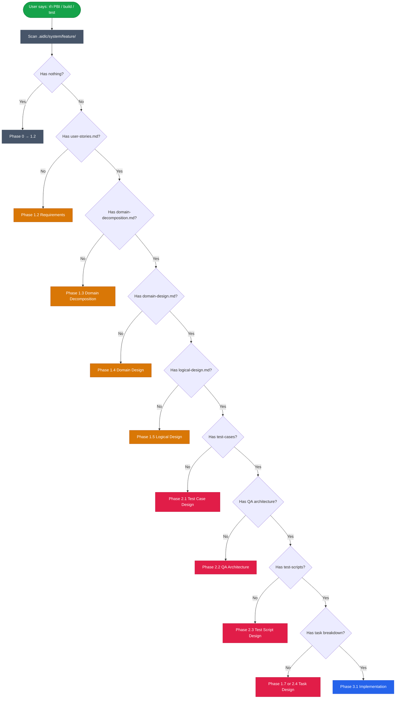
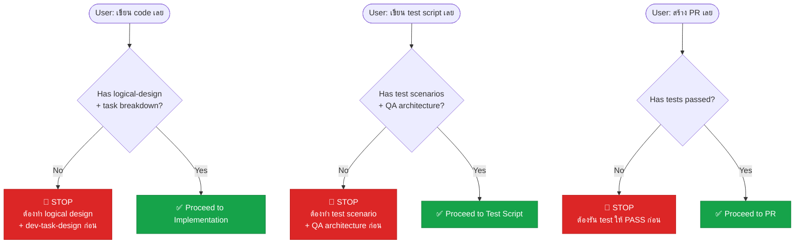
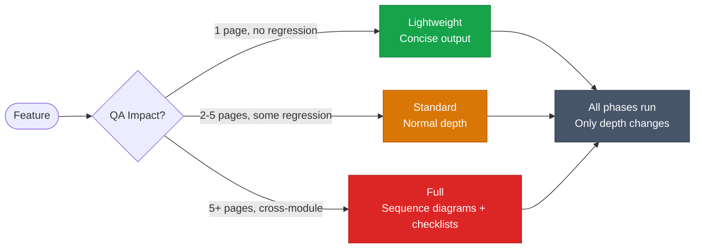
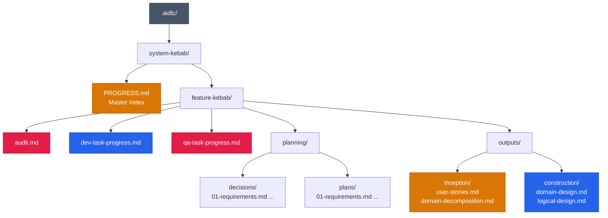
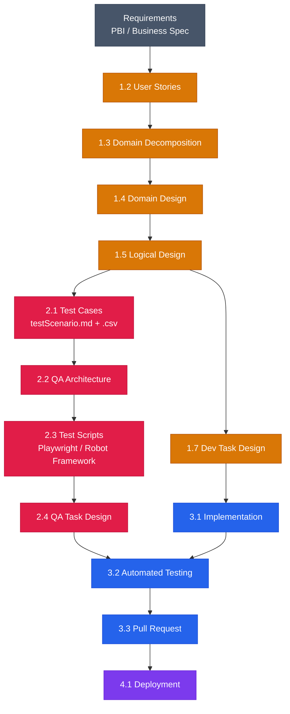
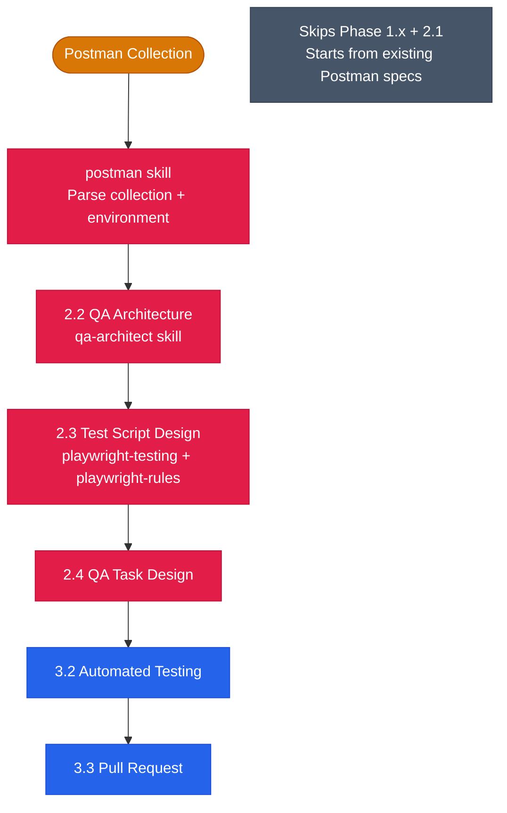

# AIDLC Workflow — Flowchart

> Color legend: 🟢 Start/End &nbsp; ⬜ Phase 0 &nbsp; 🟡 Inception (Phase 1) &nbsp; 🌸 QA (Phase 2) &nbsp; 🔵 Construction (Phase 3) &nbsp; 🟣 Deploy &nbsp; 🔴 Stop

## High-Level Overview

```mermaid
flowchart TD
    Start([Start AIDLC]) --> P0[Phase 0: Project Detection<br/>Test Root, Data Storage,<br/>Server Logic, Client App]
    P0 --> ProjectType{Project Type?}
    ProjectType -->|Brownfield| RE[1.1 Reverse Engineering<br/>Analyze Existing Codebase]
    ProjectType -->|Greenfield| RG[1.2 Requirements Gathering]
    RE --> RG

    RG --> DD[1.3 Domain Decomposition<br/>Bounded Contexts + Architecture]

    DD --> ArchChoice{Architecture?}
    ArchChoice -->|Monolith| DM[1.4 Domain Design<br/>Single File]
    ArchChoice -->|Microservices| DMS[1.4 Domain Design<br/>Per Context]

    DM --> LDM[1.5 Logical Design<br/>Data Storage / Server Logic / Client App]
    DMS --> LDMS[1.5 Logical Design<br/>Per Context]

    LDM --> UIUX[1.6 UI/UX Design<br/>Figma Analysis — ui-designer skill]
    LDMS --> UIUX
    UIUX --> DevTask[1.7 Dev Task Design<br/>Task Breakdown]

    DevTask --> TC[2.1 Test Case Design<br/>BDD Scenarios]
    TC --> QAArch[2.2 QA Architecture<br/>API / Web / Mobile / DB Strategy]
    QAArch --> TS[2.3 Test Script Design<br/>Playwright / Robot Framework]
    TS --> QATask[2.4 QA Task Design<br/>Task Breakdown]
    QATask --> ADO[2.5 DevOps Sync<br/>Azure DevOps Work Items]

    ADO --> IMP[3.1 Implementation<br/>TDD: GREEN]
    IMP --> AT[3.2 Automated Testing<br/>TDD: REFACTOR]
    AT --> TestResult{Tests Pass?}
    TestResult -->|No| BugFix[Self-Healing<br/>Max 3 Attempts]
    BugFix --> AT
    TestResult -->|Yes| PR[3.3 Create Pull Request]

    PR --> Review{PR Approved?}
    Review -->|No| Rework[Address Comments]
    Rework --> PR
    Review -->|Yes| Deploy[4.1 Deployment]

    Deploy --> End([End])

    style Start fill:#16a34a,color:#fff,stroke:#15803d
    style End fill:#16a34a,color:#fff,stroke:#15803d
    style P0 fill:#475569,color:#fff,stroke:#334155
    style RE fill:#d97706,color:#fff,stroke:#b45309
    style RG fill:#d97706,color:#fff,stroke:#b45309
    style DD fill:#d97706,color:#fff,stroke:#b45309
    style DM fill:#d97706,color:#fff,stroke:#b45309
    style DMS fill:#d97706,color:#fff,stroke:#b45309
    style LDM fill:#d97706,color:#fff,stroke:#b45309
    style LDMS fill:#d97706,color:#fff,stroke:#b45309
    style UIUX fill:#d97706,color:#fff,stroke:#b45309
    style DevTask fill:#d97706,color:#fff,stroke:#b45309
    style TC fill:#e11d48,color:#fff,stroke:#be123c
    style QAArch fill:#e11d48,color:#fff,stroke:#be123c
    style TS fill:#e11d48,color:#fff,stroke:#be123c
    style QATask fill:#e11d48,color:#fff,stroke:#be123c
    style ADO fill:#e11d48,color:#fff,stroke:#be123c
    style IMP fill:#2563eb,color:#fff,stroke:#1d4ed8
    style AT fill:#2563eb,color:#fff,stroke:#1d4ed8
    style BugFix fill:#dc2626,color:#fff,stroke:#b91c1c
    style PR fill:#2563eb,color:#fff,stroke:#1d4ed8
    style Rework fill:#dc2626,color:#fff,stroke:#b91c1c
    style Deploy fill:#7c3aed,color:#fff,stroke:#6d28d9
```

## Decision-Plan-Execute Pattern (Every Phase)

## Routing Logic (Auto-Detection)

## Anti-Shortcut Rules

## Complexity Levels

## File Structure

## Data Flow

## Postman Migration Path

## System Skills Integration (Unified Memory + Knowledge)

```mermaid
flowchart TD
    SessionStart([Session Start]) --> Bootstrap{unified-memory exists?}
    Bootstrap -->|No| Init[Step 0: Auto-init]
    Bootstrap -->|Yes| MemLoad[Load state.md + user-profile.md]
    Init --> MemLoad
    MemLoad --> HasContext{Has saved context?}
    HasContext -->|Yes| Resume[Resume from checkpoint]
    HasContext -->|No| Fresh[Start fresh]
    Resume --> Nudge[Nudge check: max 3]
    Fresh --> Nudge
    Nudge --> SkillSuggest[Skill suggestions: ACTIVE only]
    SkillSuggest --> AIDLC[AIDLC Workflow]

    AIDLC --> KnowCheck[Check knowledge index]
    KnowCheck --> HasTemplate{Existing template?}
    HasTemplate -->|Yes| Reuse[Reuse + adapt]
    HasTemplate -->|No| NewCode[Write new + auto-capture]
    Reuse --> Execute[Execute Phase]
    NewCode --> Execute

    Execute --> Phase32[Phase 3.2 Test Run]
    Phase32 --> TestResult{Tests Pass?}
    TestResult -->|Pass| ScoreUp[score +0.5 + evolution_log]
    TestResult -->|Fail| ScoreDown[score -1.0 + capture failure]
    ScoreUp --> SessionEnd
    ScoreDown --> Heal[Self-Healing] --> Phase32

    SessionEnd([Session End]) --> MemSave[Save to palace]
    MemSave --> SearchIdx[Update search indexes: keyword-index + date-index + search-index.md]
    SearchIdx --> SkillCrystal{Pattern repeated?}
    SkillCrystal -->|Yes| AutoDraft[Auto-crystallize DRAFT]
    SkillCrystal -->|No| ProfileUpdate[Update user-profile.md]
    AutoDraft --> ProfileUpdate
    ProfileUpdate --> KnowSync[Sync scores + evolution_log]
    KnowSync --> Done([Done])

    style SessionStart fill:#16a34a,color:#fff,stroke:#15803d
    style SessionEnd fill:#16a34a,color:#fff,stroke:#15803d
    style Done fill:#16a34a,color:#fff,stroke:#15803d
    style Init fill:#475569,color:#fff,stroke:#334155
    style MemLoad fill:#16a34a,color:#fff,stroke:#15803d
    style MemSave fill:#16a34a,color:#fff,stroke:#15803d
    style Nudge fill:#7c3aed,color:#fff,stroke:#6d28d9
    style SkillSuggest fill:#7c3aed,color:#fff,stroke:#6d28d9
    style KnowCheck fill:#2563eb,color:#fff,stroke:#1d4ed8
    style KnowSync fill:#2563eb,color:#fff,stroke:#1d4ed8
    style SearchIdx fill:#2563eb,color:#fff,stroke:#1d4ed8
    style SkillCrystal fill:#475569,color:#fff,stroke:#334155
    style AutoDraft fill:#d97706,color:#fff,stroke:#b45309
    style ProfileUpdate fill:#7c3aed,color:#fff,stroke:#6d28d9
    style Reuse fill:#16a34a,color:#fff,stroke:#15803d
    style NewCode fill:#d97706,color:#fff,stroke:#b45309
    style ScoreUp fill:#16a34a,color:#fff,stroke:#15803d
    style ScoreDown fill:#dc2626,color:#fff,stroke:#b91c1c
    style Heal fill:#dc2626,color:#fff,stroke:#b91c1c
    style AIDLC fill:#475569,color:#fff,stroke:#334155
    style Execute fill:#475569,color:#fff,stroke:#334155
```

