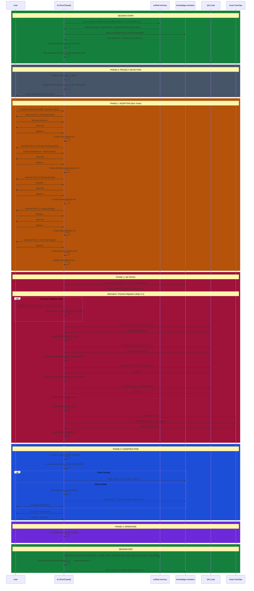
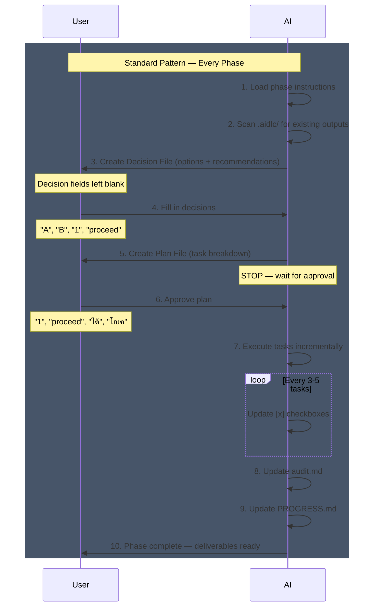
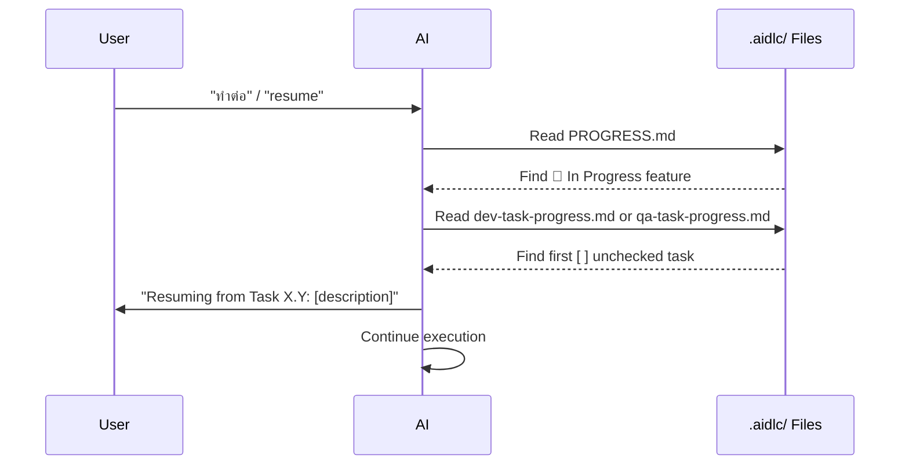
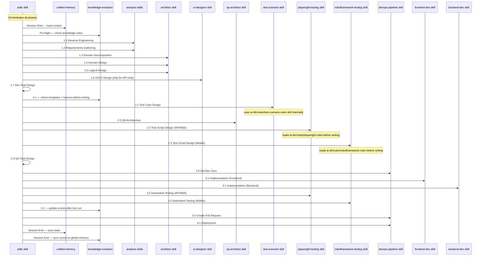

# AIDLC Workflow — Swimlane Diagrams

## Complete Workflow

```mermaid
sequenceDiagram
    participant User as User
    participant AI as AI (Kiro/Claude)
    participant Mem as unified-memory
    participant Know as knowledge-evolution
    participant QA as QA Lead
    participant ADO as Azure DevOps

    rect rgb(21, 128, 61)
    Note over User,ADO: SESSION START
    AI->>Mem: Load context (.unified-memory/palace/state.md + user-profile.md)
    Mem-->>AI: Last checkpoint + open threads + user preferences (hints only)
    AI->>Know: Check knowledge index (ai-dlc/knowledge/)
    Know-->>AI: Top templates + lessons for this domain
    AI->>AI: Nudge check (6 rules, max 3 shown)
    AI->>AI: Skill suggestions (ACTIVE skills matching task)
    end

    rect rgb(71, 85, 105)
    Note over User,ADO: PHASE 0: PROJECT DETECTION
    AI->>AI: Scan for playwright.config.ts
    AI->>AI: Detect Data Storage / Server Logic / Client App
    AI->>User: Report detected project structure
    end

    rect rgb(180, 83, 9)
    Note over User,ADO: PHASE 1: INCEPTION (Dev Track)

    User->>AI: Provide requirements (PBI / Business Spec)

    AI->>User: Decision File (1.2 Requirements)
    User->>AI: Resolve decisions
    AI->>User: Plan File
    User->>AI: Approve
    AI->>AI: Create user-stories.md

    AI->>User: Decision File (1.3 Domain Decomposition)
    User->>AI: Choose Architecture + Multi-Tenancy
    AI->>User: Plan File
    User->>AI: Approve
    AI->>AI: Create domain-decomposition.md

    AI->>User: Decision File (1.4 Domain Design)
    User->>AI: Resolve
    AI->>User: Plan File
    User->>AI: Approve
    AI->>AI: Create domain-design.md

    AI->>User: Decision File (1.5 Logical Design)
    User->>AI: Resolve
    AI->>User: Plan File
    User->>AI: Approve
    AI->>AI: Create logical-design.md

    AI->>User: Decision File (1.7 Dev Task Design)
    User->>AI: Approve
    AI->>AI: Create dev-task-progress.md
    AI->>AI: Update PROGRESS.md
    end

    rect rgb(159, 18, 57)
    Note over User,ADO: PHASE 2: QA TRACK

    AI->>Know: Check existing templates + lessons before writing
    Know-->>AI: Reuse candidates (sorted by utility_score)

    Note over User,ADO: Alternative: Postman Migration (skips 2.1)
    opt Postman Migration path
        User->>AI: Provide Postman collection + environment JSON
        AI->>AI: postman skill — parse + analyze collection
    end

    AI->>QA: Decision File (2.1 Test Case Design)
    QA->>AI: Approve test strategy
    AI->>AI: Create testScenario.md + .csv

    AI->>QA: Decision File (2.2 QA Architecture)
    QA->>AI: Approve architecture
    AI->>AI: Create implementation plan (API/Web/Mobile)

    AI->>QA: Decision File (2.3 Test Script Design)
    QA->>AI: Approve
    AI->>AI: Generate Playwright / Robot Framework scripts

    AI->>QA: Decision File (2.4 QA Task Design)
    QA->>AI: Approve
    AI->>AI: Create qa-task-progress.md
    AI->>AI: Update PROGRESS.md

    AI->>ADO: 2.5 DevOps Sync
    AI->>ADO: Create PBIs + Tasks + Test Cases
    ADO-->>AI: Return Work Item IDs
    AI->>AI: Update local files with IDs
    end

    rect rgb(29, 78, 216)
    Note over User,ADO: PHASE 3: CONSTRUCTION

    AI->>AI: 3.1 Implementation (TDD: GREEN)
    AI->>AI: 3.2 Automated Testing (TDD: REFACTOR)

    alt Tests Passed
        AI->>Know: utility_score += 0.5, usage_count += 1
    else Tests Failed
        AI->>AI: Self-Healing (max 3 attempts)
        AI->>Know: utility_score -= 1.0, auto-capture failure lesson
        AI->>User: Escalate if still failing
    end

    AI->>User: 3.3 Create Pull Request
    User->>AI: Review + Approve
    end

    rect rgb(109, 40, 217)
    Note over User,ADO: PHASE 4: OPERATION
    AI->>AI: 4.1 Deployment (CI/CD Pipeline)
    end

    rect rgb(21, 128, 61)
    Note over User,ADO: SESSION END
    AI->>Mem: Save state (.unified-memory/palace/ — wings, rooms, keyword-index, date-index, search-index, user-profile)
    AI->>AI: Skill crystallization check (pattern ≥2x → auto-write DRAFT)
    AI->>Know: Sync scores + evolution_log[] to index.json
    end
```

## Decision-Plan-Execute Pattern

```mermaid
sequenceDiagram
    participant User as User
    participant AI as AI

    rect rgb(71, 85, 105)
    Note over User,AI: Standard Pattern — Every Phase

    AI->>AI: 1. Load phase instructions
    AI->>AI: 2. Scan .aidlc/ for existing outputs
    AI->>User: 3. Create Decision File (options + recommendations)
    Note over User: Decision fields left blank

    User->>AI: 4. Fill in decisions
    Note over User: "A", "B", "1", "proceed"

    AI->>User: 5. Create Plan File (task breakdown)
    Note over AI: STOP — wait for approval

    User->>AI: 6. Approve plan
    Note over User: "1", "proceed", "ได้", "โอเค"

    AI->>AI: 7. Execute tasks incrementally
    loop Every 3-5 tasks
        AI->>AI: Update [x] checkboxes
    end

    AI->>AI: 8. Update audit.md
    AI->>AI: 9. Update PROGRESS.md
    AI->>User: 10. Phase complete — deliverables ready
    end
```

## Resume Protocol

```mermaid
sequenceDiagram
    participant User as User
    participant AI as AI
    participant Files as .aidlc/ Files

    User->>AI: "ทำต่อ" / "resume"
    AI->>Files: Read PROGRESS.md
    Files-->>AI: Find 🔄 In Progress feature
    AI->>Files: Read dev-task-progress.md or qa-task-progress.md
    Files-->>AI: Find first [ ] unchecked task
    AI->>User: "Resuming from Task X.Y: [description]"
    AI->>AI: Continue execution
```

## Skill Routing (Which Skill Handles Which Phase)

```mermaid
sequenceDiagram
    participant AIDLC as aidlc skill
    participant Mem as unified-memory
    participant Know as knowledge-evolution
    participant Analysis as analysis-skills
    participant Architect as architect skill
    participant UIDesigner as ui-designer skill
    participant QAArch as qa-architect skill
    participant TestScen as test-scenario skill
    participant PW as playwright-testing skill
    participant RF as robotframework-testing skill
    participant DevOps as devops-pipeline skill
    participant FE as frontend-dev skill
    participant BE as backend-dev skill

    Note over AIDLC: Orchestrates all phases

    AIDLC->>Mem: Session Start — load context
    AIDLC->>Know: Pre-flight — check knowledge index

    AIDLC->>Analysis: 1.1 Reverse Engineering
    AIDLC->>Analysis: 1.2 Requirements Gathering
    AIDLC->>Architect: 1.3 Domain Decomposition
    AIDLC->>Architect: 1.4 Domain Design
    AIDLC->>Architect: 1.5 Logical Design
    AIDLC->>UIDesigner: 1.6 UI/UX Design (skip for API-only)
    AIDLC->>AIDLC: 1.7 Dev Task Design

    AIDLC->>Know: 2.x — check templates + lessons before writing
    AIDLC->>TestScen: 2.1 Test Case Design
    Note over TestScen: uses ai-dlc/rules/test-scenario-rules skill internally
    AIDLC->>QAArch: 2.2 QA Architecture
    AIDLC->>PW: 2.3 Test Script Design (API/Web)
    Note over PW: loads ai-dlc/rules/playwright-rules before writing
    AIDLC->>RF: 2.3 Test Script Design (Mobile)
    Note over RF: loads ai-dlc/rules/robotframework-rules before writing
    AIDLC->>AIDLC: 2.4 QA Task Design
    AIDLC->>DevOps: 2.5 DevOps Sync

    AIDLC->>FE: 3.1 Implementation (Frontend)
    AIDLC->>BE: 3.1 Implementation (Backend)
    AIDLC->>PW: 3.2 Automated Testing (API/Web)
    AIDLC->>RF: 3.2 Automated Testing (Mobile)
    AIDLC->>Know: 3.2 — update scores after test run
    AIDLC->>DevOps: 3.3 Create Pull Request
    AIDLC->>DevOps: 4.1 Deployment

    AIDLC->>Mem: Session End — save state
    AIDLC->>Know: Session End — sync scores to global memory
```
