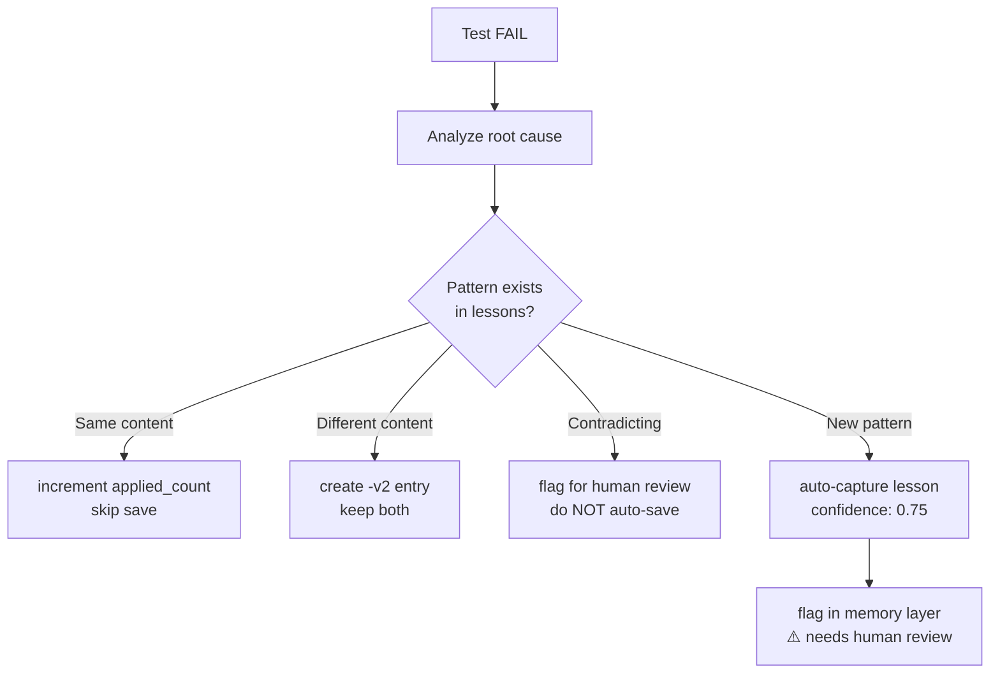

# 🧠 Knowledge Evolution

A pattern for making any knowledge base self-improving through execution feedback.
No new dependencies. Works with any storage format. Adapt to any domain.

---

## Table of Contents

1. [Why This Exists](#1-why-this-exists)
2. [The Problem It Solves](#2-the-problem-it-solves)
3. [Research Foundation](#3-research-foundation)
4. [Core Concept: Closed Loop](#4-core-concept-closed-loop)
5. [Three Layers](#5-three-layers)
6. [Auto-Capture Protocol](#6-auto-capture-protocol)
7. [Advanced Capabilities](#7-advanced-capabilities)
8. [Implementation Phases](#8-implementation-phases)
9. [Reference Files](#9-reference-files)
10. [How to Adapt](#10-how-to-adapt)
11. [Design Principles](#11-design-principles)
12. [Industry Gap Analysis (2026)](#12-industry-gap-analysis-2026)
13. [Concepts Sourced From](#13-concepts-sourced-from)

---

## 1. Why This Exists

Most knowledge bases are **static** — every template looks equally good, every lesson looks equally important. There's no signal about what actually works.

This pattern was designed by studying how self-evolving agent frameworks (Memento-Skills, EvoSkill, ACE, Trace2Skill, ASG-SI) solve this problem, then extracting the concepts that work without requiring a Python runtime, vector database, or cloud infrastructure.

The result: a knowledge base that improves itself from execution experience, using only the markdown and json files that already exist.

---

## 2. The Problem It Solves

**Static knowledge base problems:**
- Template A and Template B look identical — no way to know which one causes failures
- Lesson from 2 years ago is shown first even though it's no longer relevant
- New failure patterns require manual intervention to capture
- No feedback loop — using knowledge doesn't improve it

**What this pattern adds:**
- Templates that work get higher scores → shown first in routing
- Templates that cause failures get flagged → warn before use
- New patterns captured automatically after failures
- Lessons sorted by how many failures they've prevented

---

## 3. Research Foundation

This skill distills concepts from 6 frameworks. None of their code is used — only the ideas.

### Memento-Skills (arXiv:2603.18743)
Self-evolving Python agent framework. Key insight: **closed Read→Execute→Reflect→Write loop** where every execution feeds back into the skill library. Benchmarks: GAIA +26.2%, HLE +116.2%.

### EvoSkill (arXiv:2603.02766)
Analyzes execution failures → proposes skill edits → keeps only skills that improve validation (Pareto frontier). Key insight: **failure analysis → auto-capture** and **utility scoring** to keep only what works.

### Trace2Skill (arXiv:2603.25158)
Parallel fleet of sub-agents analyzes execution traces → distills into conflict-free, transferable skills. Key insight: **read all traces first, then write** (avoids sequential bias) and **conflict-free consolidation** before writing.

### ACE — Agentic Context Engineering (arXiv:2510.04618, Stanford/SambaNova)
Contexts as "evolving playbooks" — accumulate, refine, organize strategies through generation → reflection → curation. Key insight: **structured incremental updates prevent context collapse** (same as AAAK compression). Results: +10.6% on agent benchmarks, 49% token reduction.

### ASG-SI (arXiv:2512.23760)
Self-improvement as iterative compilation into a growing, auditable skill graph. Key insight: **verifier-backed promotion** — never promote a skill until it passes replay checks (same as admission control ≥0.6).

### OpenSpace
Self-evolving engine that plugs into AI agents. Key insight: **workflow reuse** — proven workflows get reused, reducing token cost -46%, output/hour +4.2x.

### How These Map to This Skill

| Concept | Source | Where in this skill |
|---------|--------|---------------------|
| Closed loop Read→Execute→Reflect→Write | Memento-Skills | Core concept |
| Utility scoring + Pareto selection | EvoSkill, OpenSpace | `utility-scoring.md` |
| Failure analysis → auto-capture | EvoSkill, ACE | `utility-scoring.md` §5 |
| Parallel trace analysis | Trace2Skill | `parallel-analysis.md` |
| Conflict-free consolidation | Trace2Skill, ASG-SI | `utility-scoring.md` §6 |
| Verifier-backed promotion | ASG-SI | `utility-scoring.md` §5 (confidence ≥0.6) |
| Living Skillbook → context injection | ACE | `memory-integration.md` |
| Structured incremental updates | ACE | `auto-consolidation.md` |
| BM25 + semantic routing | Memento-Skills | `semantic-routing.md` |
| Auto-Dream / memory consolidation | Anthropic Claude Code (2026) | `auto-consolidation.md` |

---

## 4. Core Concept: Closed Loop

```
Read → Execute → Reflect → Write
  ↑                           ↓
  └─────── knowledge ─────────┘
```

| Step | What happens | Example |
|------|-------------|---------|
| Read | Load relevant knowledge | Read template + lessons before writing test |
| Execute | Use that knowledge | Write test using template |
| Reflect | Analyze outcome | Did test pass? Did lesson help? |
| Write | Update knowledge | Score up/down, capture new lesson |

Every execution produces a signal. The system learns which knowledge is reliable without human intervention.

---

## 5. Three Layers

### Layer 1 — Utility Scoring

Add quality signals to every knowledge item:

```json
// Template fields
{
  "utility_score": 5.0,
  "usage_count": 0,
  "last_used": null,
  "last_failure": null,
  "auto_captured": false
}

// Lesson fields
{
  "effectiveness": {
    "applied_count": 0,
    "prevented_failures": 0,
    "still_relevant": true,
    "confidence": 1.0
  },
  "auto_captured": false
}
```

Score thresholds:

| Score | Status | Action |
|-------|--------|--------|
| ≥ 7.0 | ✅ Proven | Prefer first in routing |
| 3.0–6.9 | 🟡 Active | Normal use |
| < 3.0 | ⚠️ Flagged | Warn before use |
| 0.0 | 🔴 Deprecated | Skip unless explicit |

### Layer 2 — Smart Routing

Intent matching before keyword fallback:

```
1. Extract intent: "Input → Process → Output"
2. Match intent_patterns (semantic level)
3. If match → load domain
4. If no match → keyword fallback (original)
5. If multiple matches → sort by utility_score DESC → pick top
6. If top score < threshold → warn user
```

Intent pattern format: `{Input} → {Process} → {Output}`

### Layer 3 — Memory Integration

Memory layer = tracking buffer. Knowledge files = source of truth.

```
Session Start:
  → Load knowledge-evolution wing (if exists)
  → Brief: top scores, top lessons, flags, gaps

Session End:
  → Update tracking rooms with score changes
  → Sync back to knowledge index files
  → Compress to AAAK if rooms >80 lines
```

---

## 6. Auto-Capture Protocol

When a test fails and the root cause is a new pattern:



Confidence levels:
- `1.0` — human-curated, always trusted
- `0.8` — healed (test passed after fix), trusted
- `0.75` — inferred from failure, needs review
- `< 0.6` — skip in routing until reviewed

Human override always wins. Auto-captured knowledge is advisory, not authoritative.

---

## 7. Advanced Capabilities

### Auto-Consolidation (inspired by Anthropic Auto-Dream)

Periodically clean up the knowledge base automatically:
- Deduplicate lessons with same root cause
- Soft-delete stale entries (not used in N days)
- Normalize relative dates to absolute
- Flag contradicting entries for human review

Trigger: after N sessions or D days since last consolidation.
See `references/auto-consolidation.md` for full protocol.

### Semantic Routing (BM25 + Embeddings)

Upgrade from manual intent_patterns when knowledge base grows large:
- Level 0: intent_patterns (manual, current)
- Level 1: BM25 text ranking (no model needed)
- Level 2: BM25 + vector embeddings (semantic)

Upgrade trigger: >50 templates OR >100 lessons.
See `references/semantic-routing.md` for upgrade path.

### Parallel Trace Analysis (inspired by Trace2Skill)

For batch failure analysis (>5 failures in one run):
- Read ALL traces first, build full picture
- Identify cross-trace patterns before writing any lesson
- Write consolidated, conflict-free lessons in one batch

Avoids sequential bias from processing one failure at a time.
See `references/parallel-analysis.md` for protocol.

---

## 8. Implementation Phases

```mermaid
gantt
    title Knowledge Evolution — Phase Roadmap
    dateFormat  X
    axisFormat Phase %s

    section Phase A (Foundation)
    Add score fields to index files     :a1, 0, 1
    Add effectiveness fields to lessons :a2, 0, 1
    Add intent_patterns to domain index :a3, 0, 1
    Update save/capture protocol        :a4, 0, 1

    section Phase B (Activate)
    Post-execution score update         :b1, 1, 2
    Score-weighted routing              :b2, 1, 2
    Lesson effectiveness sorting        :b3, 1, 2

    section Phase C (Memory)
    Create knowledge-evolution wing     :c1, 2, 3
    Session start/end protocol          :c2, 2, 3
    Write-back sync                     :c3, 2, 3

    section Phase D (Automate)
    Post-execution hook                 :d1, 3, 4
    Session-end sync hook               :d2, 3, 4
```



- **Phase A** — Add fields only. No behavior change. Safe to do immediately.
- **Phase B** — Activate scoring in workflow. Requires Phase A.
- **Phase C** — Connect memory layer for cross-session tracking.
- **Phase D** — Automate with hooks. No manual triggers needed.

---

## 9. Reference Files

| When | Load |
|------|------|
| Add score fields, update protocol after test pass/fail | `references/utility-scoring.md` |
| Add intent_patterns, update routing, sort lessons | `references/smart-routing.md` |
| Knowledge base >50 templates / >100 lessons | `references/semantic-routing.md` |
| Create knowledge-evolution wing, session sync, tunnels | `references/memory-integration.md` |
| Deduplicate, prune stale, auto-clean knowledge | `references/auto-consolidation.md` |
| Analyze multiple failures at once, batch lesson capture | `references/parallel-analysis.md` |
| Phase A→D roadmap, {placeholders} for adaptation | `references/implementation-guide.md` |

---

## 10. How to Adapt

This skill describes **concepts**, not implementations. Map `{placeholders}` to your system:

| Placeholder | Example mapping |
|-------------|----------------|
| `{knowledge_store}` | `ai-dlc/knowledge/` (json + md files) |
| `{index_file}` | `apiIndex.json`, `webUiIndex.json` |
| `{execution_trigger}` | test run, CI pipeline, build step |
| `{score_field}` | `utility_score` (0–10 scale) |
| `{lesson_store}` | `lessons/api/`, `lessons/webUi/` |
| `{routing_logic}` | discovery phase, search function |
| `{memory_layer}` | Memory Palace wing, database, file |

Steps:
1. Read `references/implementation-guide.md`
2. Map `{placeholders}` to your system
3. Do Phase A first — safe, no behavior change
4. Do Phase B–D in order

---

## 11. Design Principles

- **No new dependencies** — works with whatever storage format already exists
- **Additive only** — new fields don't break existing consumers
- **Graceful degradation** — if score is missing, treat as neutral (5.0), never block
- **Human override always wins** — auto-captured knowledge is advisory
- **Source of truth stays in files** — memory layers are caches, not replacements

---

## 12. Industry Gap Analysis (2026)

Compared against Anthropic Auto-Dream, Trace2Skill, and the retrieval-first era:

| Gap | Status | Reference |
|-----|--------|-----------|
| Auto-consolidation (dedup, stale, normalize) | ✅ Covered | `references/auto-consolidation.md` |
| Semantic routing (BM25 + embeddings) | ✅ Covered | `references/semantic-routing.md` |
| Parallel trace analysis (conflict-free) | ✅ Covered | `references/parallel-analysis.md` |

When to upgrade:
- Auto-consolidation: now — add agentStop hook
- Semantic routing: when knowledge/ has >50 templates or >100 lessons
- Parallel analysis: when test suite produces >5 failures per run

---

## 13. Concepts Sourced From

| Concept | Source |
|---------|--------|
| Closed loop Read→Execute→Reflect→Write | Memento-Skills (arXiv:2603.18743) |
| Utility scoring + Pareto selection | EvoSkill (arXiv:2603.02766), OpenSpace |
| Failure analysis → auto-capture | EvoSkill, ACE (arXiv:2510.04618) |
| Conflict-free consolidation | Trace2Skill (arXiv:2603.25158) |
| Parallel trace analysis | Trace2Skill (arXiv:2603.25158) |
| Verifier-backed promotion | ASG-SI (arXiv:2512.23760) |
| Living Skillbook → context injection | ACE (Agentic Context Engineering) |
| Structured incremental updates | ACE (prevents context collapse) |
| Auto-consolidation / Auto-Dream | Anthropic Claude Code (2026) |
| BM25 + semantic routing | Memento-Skills, Retrieval-First Era (2026) |

## อ้างอิง

- [Memento-Skills GitHub](https://github.com/Memento-Teams/Memento-Skills) — source ของ concepts ที่นำมาประยุกต์
- [arXiv:2603.18743](https://arxiv.org/abs/2603.18743) — paper: "Memento-Skills: Let Agents Design Agents"
- Benchmark results: GAIA +26.2%, HLE +116.2% relative improvement

- [EvoSkill](https://arxiv.org/abs/2603.02766) — Automated Skill Discovery for Multi-Agent Systems
- [Trace2Skill](https://arxiv.org/abs/2603.25158) — Distill Trajectory-Local Lessons into Transferable Agent Skills
- [ACE Paper](https://arxiv.org/abs/2510.04618) — Agentic Context Engineering (Stanford/SambaNova)
- [ACE Open-source](https://github.com/kayba-ai/agentic-context-engine) — pip install ace-framework
- [ASG-SI](https://arxiv.org/abs/2512.23760) — Audited Skill-Graph Self-Improvement
- [OpenSpace](https://www.scriptbyai.com/self-evolving-engine-openspace/) — Self-Evolving Engine for AI Agents