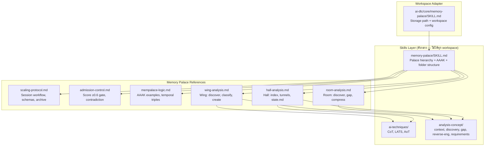
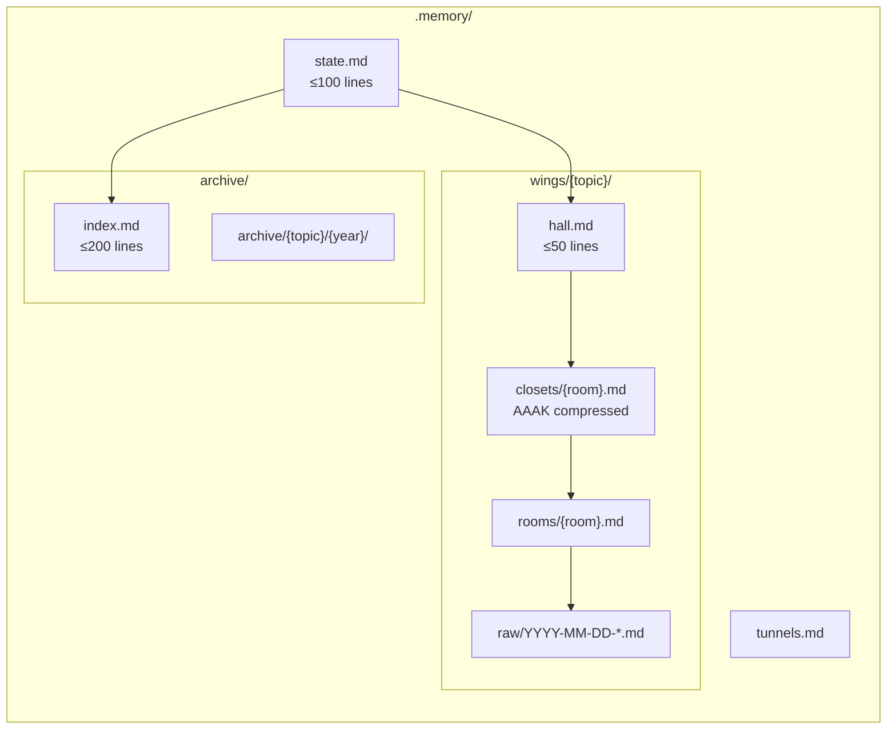
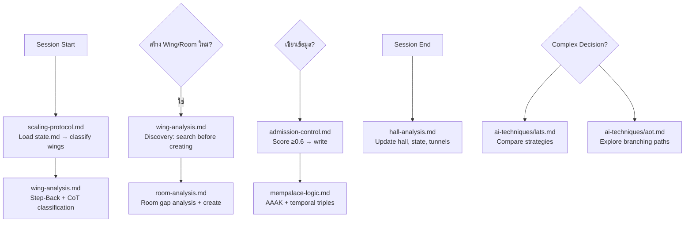
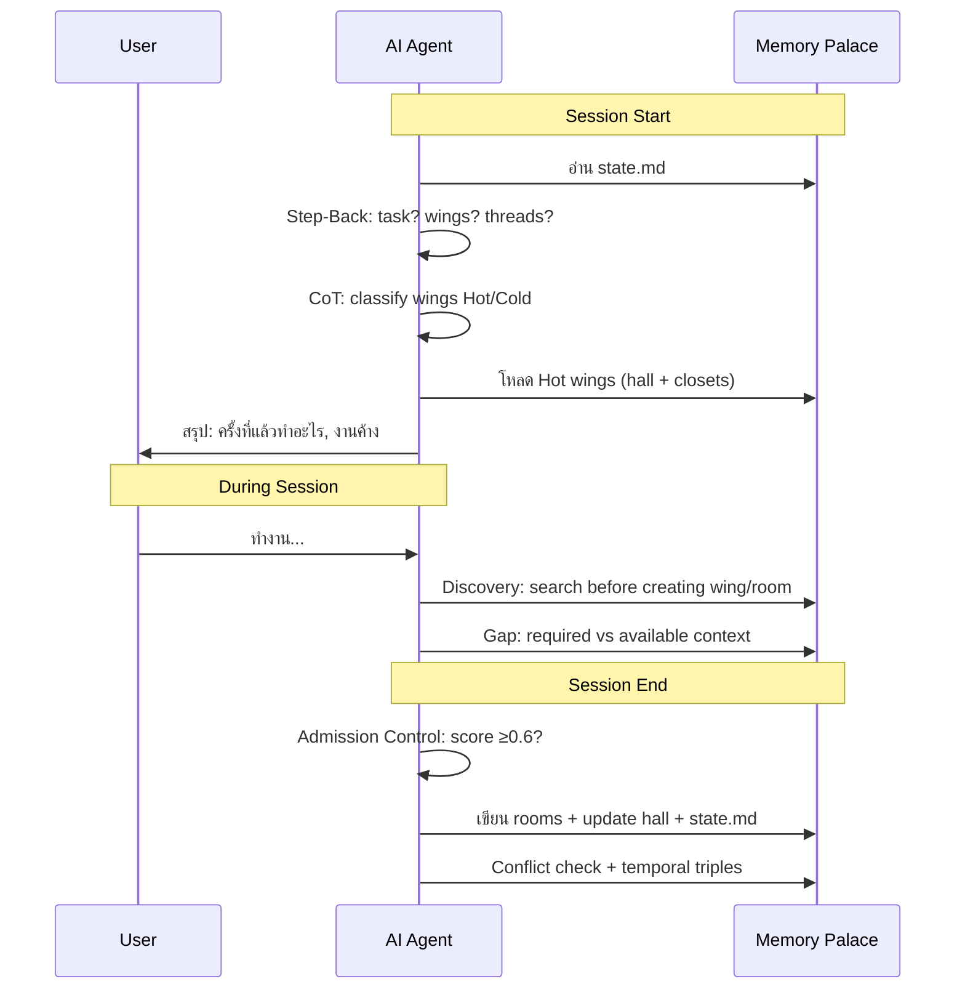

# 🏛️ Memory Palace — คู่มือภาษาไทย

ระบบความจำถาวรสำหรับ AI ข้ามหลาย chat session โดยใช้แนวคิด "Memory Palace" (วิธีจำของนักปราชญ์กรีกโบราณ)

---

## ทำไมต้องมี Memory Palace?

ปัญหาหลักของ AI คือ **ทุก chat session เริ่มใหม่จากศูนย์** — ไม่รู้ว่าครั้งที่แล้วทำอะไรไป ตัดสินใจอะไร หรือโค้ดอยู่ที่ไหน

Memory Palace แก้ปัญหานี้โดยให้ AI **เขียนบันทึกลงไฟล์** ก่อนจบ session และ **อ่านบันทึกนั้น** ตอนเริ่ม session ใหม่

---

## สถาปัตยกรรมภาพรวม



---

## โครงสร้าง Palace (ที่เก็บข้อมูลจริง)



```text
{project}/.memory/
├── state.md              ← แผนที่ palace: มี wing อะไรบ้าง, session ล่าสุด, งานค้าง
├── tunnels.md            ← cross-reference ระหว่าง wing
├── wings/
│   └── {topic}/
│       ├── hall.md       ← index ของ wing นี้ (มี room อะไรบ้าง)
│       ├── rooms/
│       │   └── {topic}.md    ← รายละเอียดเต็มของแต่ละ topic
│       ├── closets/
│       │   └── {summary}.md  ← สรุปแบบ AAAK เมื่อ room ยาวเกิน 80 บรรทัด
│       └── raw/
│           └── YYYY-MM-DD-{desc}.md  ← verbatim records
└── archive/
    ├── index.md          ← searchable index ของงานเก่า
    └── {topic}/{year}/   ← archived wings จัดตาม topic แล้วแยกปี
```

---

## ลำดับชั้น Palace

| ชั้น | ชื่อ | คืออะไร | เปรียบเหมือน |
|------|------|---------|--------------|
| L0 | **Wing** | project หรือ domain | ปีกของอาคาร |
| L1 | **Room** | topic เฉพาะเจาะจง พร้อมรายละเอียดเต็ม | ห้องในปีก |
| L2 | **Closet** | สรุปแบบ AAAK ของ room | ตู้เสื้อผ้าในห้อง |
| L3 | **Drawer/Raw** | verbatim records, exact reasoning | ลิ้นชักในตู้ |
| L4 | **Hall / Tunnel** | เชื่อม room ภายใน wing / ข้าม wing | ทางเดินเชื่อม |

---

## Reference Files — ใช้อะไรตอนไหน



| เมื่อไหร่ | โหลดไฟล์ไหน |
|-----------|------------|
| Session start/end, schemas, archive | `references/scaling-protocol.md` |
| ตัดสินใจจะเขียนหรือไม่, contradiction | `references/admission-control.md` |
| Wing: discover, classify, create, archive | `references/wing-analysis.md` |
| Room: discover, gap, create, compress | `references/room-analysis.md` |
| Hall: index, tunnels, state.md, health | `references/hall-analysis.md` |
| AAAK examples, temporal triples | `references/mempalace-logic.md` |

Underlying concepts (ถูกรวมไว้ใน analysis files ด้านบนแล้ว):
- Reasoning: `system/ai-techniques/` (CoT, LATS, AoT)
- Analysis: `system/analysis-concept/` (context, discovery, gap, reverse-eng, requirements)

---

## AAAK Compression คืออะไร?

แทนที่จะเขียนภาษาอังกฤษยาวๆ ใช้ shorthand ที่ AI อ่านออกแต่กิน token น้อยกว่า

**แบบปกติ (verbose):**
```text
The script currently processes 473 requests from the iuser-convert collection,
splitting them by top-level folder into separate spec files.
```

**แบบ AAAK:**
```text
@Script:postmanMdToPlaywright | v:7 | Input:iuser-convert(473req)
Mode: auto-split by topFolder → separate spec/helper/service per folder
```

ประหยัด token ได้ ~60-70% เหมาะสำหรับ closet files

---

## Temporal Triples คืออะไร?

แทนที่จะ overwrite ข้อมูลเก่า ให้บันทึกว่า "ข้อมูลนี้ถูกต้องในช่วงเวลาไหน"

```text
(MemPalace, architecture, single-skill) [2025-04-09 — 2025-04-09]
(MemPalace, architecture, 2-tier)       [2025-04-09 — Present]
```

ทำให้ย้อนดูได้ว่า "ตอนนั้นตัดสินใจอะไร และเปลี่ยนเมื่อไหร่"

---

## Contradiction Detection

ก่อนเขียนทับข้อมูลเก่า AI จะ check ว่า:
1. มี active triple (valid_to = null) สำหรับ subject/predicate นี้อยู่มั้ย?
2. ข้อมูลใหม่ขัดแย้งกับ strategy ที่กำหนดไว้มั้ย?
3. ถ้าขัดแย้ง → แจ้ง user ก่อน ไม่ overwrite เงียบๆ

---

## Session Workflow



---

## การทำงานอัตโนมัติ

**Hook `agentStop`** (`.kiro/hooks/memory-palace-save.kiro.hook`)
ทุกครั้งที่ AI หยุดทำงาน hook จะ remind ให้ AI บันทึก memory ตาม 10 ขั้นตอน:
- อ่าน `.memory/state.md` → สร้าง/อัพเดท wing → เขียน rooms → compress closets → อัพเดท state.md

---

## เริ่ม session ใหม่ยังไง?

บอก AI ว่า:
> "อ่าน memory palace แล้วทำต่อจากครั้งที่แล้ว"

AI จะ:
1. อ่าน `{project}/.memory/state.md`
2. Step-Back: task? wings? threads?
3. CoT: classify wings → load Hot wings
4. สรุปให้ฟังว่าครั้งที่แล้วทำอะไรไปแล้ว

---

## 🗂️ Archive System

เมื่อ wing ไม่ active แล้ว หรือ state.md เริ่มยาว → ย้ายไป archive

### เมื่อไหร่ควร Archive?
- Wing ไม่มี activity > 2 sprint
- Recent Sessions ใน state.md > 10 rows → ย้าย rows เก่าไป archive
- User บอก "archive {wing-name}"

### ค้นหาของเก่ายังไง?
บอก AI ว่า:
> "ค้นหา {keyword} ในงานเก่า"

AI จะ:
1. อ่าน `archive/index.md` → หา topic ที่ match
2. อ่าน `archive/{topic}/summary.md` → ดู overview
3. Drill down ไป rooms/ ถ้าต้องการ detail

---

## Approach

Markdown-only — ไม่มี dependency, ไม่มี database, pure markdown files

---

## อ้างอิง

- [MemPalace GitHub](https://github.com/milla-jovovich/mempalace) — ต้นแบบ concept
- 96.6% R@5 on LongMemEval benchmark
- Analysis concepts adapted from `ai-dlc/core/analysis-skills/`
- Reasoning techniques from `system/ai-techniques/` (CoT, LATS, AoT)
