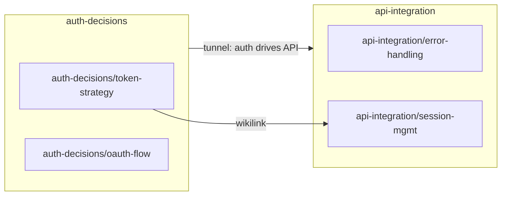

# Storage — Wings, Rooms, Closets, Halls, Tunnels, Archive

Everything about WHERE and HOW things are stored in Memory Palace.

---

## Hierarchy

```
L0: Wing    — top-level domain/project  e.g. "api-integration", "form-redesign"
L1: Room    — specific topic, full detail  e.g. "error-handling", "auth-decisions"
L2: Closet  — AAAK-compressed summary of a Room (read first for global state)
L3: Raw     — verbatim records, exact reasoning (accessed on-demand only)
L4: Hall    — index of rooms within a wing (≤50 lines)
    Tunnel  — cross-wing reference link (wing A ↔ wing B)
```

```
.unified-memory/
├── palace/
│   ├── state.md                      ← palace map (≤100 lines)
│   ├── tunnels.md                    ← cross-wing links
│   ├── graph.json                    ← [Obsidian] machine-readable graph (auto-generated)
│   ├── graph.md                      ← [Obsidian] Mermaid visual graph (auto-generated)
│   ├── wings/
│   │   └── {topic}/
│   │       ├── hall.md               ← wing index (≤50 lines)
│   │       ├── hall-detail.md        ← overflow from hall (optional)
│   │       ├── rooms/{room}.md       ← full detail (with frontmatter + wikilinks)
│   │       ├── closets/{room}.md     ← AAAK compressed (when room >80 lines)
│   │       └── raw/YYYY-MM-DD-*.md   ← verbatim records
│   └── archive/
│       ├── index.md                  ← searchable index (≤200 lines)
│       └── {topic}/{year}/
│           ├── rooms/, closets/, raw/
│           ├── sessions.md
│           └── summary.md
└── knowledge/
    ├── index.json                    ← domain catalog + utility_score
    └── lessons/{domain}/
        ├── *LessonsIndex.json
        └── *.md
```

**Rules:**
- Top-level .unified-memory/palace/ contains ONLY: state.md, tunnels.md, wings/, archive/
- Max folder depth = 4 levels
- hall.md ≤ 50 lines. Overflow → hall-detail.md

---

## Wing

### Before Creating — Search First
```
Discovery check:
  1. Read state.md → list all active wings
  2. Score semantic overlap with new topic (0–10)
  3. ≥70% overlap → update existing wing, don't create new
  4. <70% → create new wing

Naming: kebab-case, lowercase, domain-specific
  Good: "payment-api", "form-redesign", "auth-decisions"
  Bad:  "api" (too broad), "work" (too vague)
```

### Wing Classification (Hot / Cold / Warm)
```
Hot  = relevant to today's task (score ≥5/10) → load hall + closets
Warm = adjacent to task (score 3–4/10)        → load hall only
Cold = unrelated today (score <3/10)           → one summary line

On-demand promotion: Cold/Warm → Hot when task requires it
```

### hall.md Schema
```markdown
# {Wing Name} — Hall

Last_Updated: YYYY-MM-DD
Token_Estimate: {n}

## Summary
{One sentence: what this wing is about}

## Status
Hot | Warm | Cold | Pending Archive

## Rooms
| Room | Description | Lines | Last Updated |
|------|-------------|-------|--------------|
| error-handling | REST error handler patterns | 42 | 2026-04-18 |

## Open Threads
- {thread}: {description}

## Key Decisions
- {date}: {decision made}
```

### Hall Health (Check at Session End)
```
1. List all files in rooms/
2. Compare to hall.md room list
3. In directory but not in hall → add
4. In hall but not in directory → remove
5. Update Token_Estimate if changed
```

---

## Room

### Before Creating — Gap Analysis
```
1. Load wing's hall.md
2. Search rooms for this topic
3. Topic exists → update existing room
4. Partial match → add section to existing
5. Clearly distinct → create new room
```

### Writing Rules
```
- Length: 30–80 lines optimal
- Over 80 lines → create closet (AAAK)
- One room = one topic (single responsibility)
- Format: facts + decisions, not narrative
- Include: what decided, why, when, what rejected
- No filler: "decided: {X}" not "we decided to..."
```

### Room Schema
```markdown
---
wing: {wing-name}
status: hot | warm | cold
tags: [{tag1}, {tag2}, {tag3}]
created: YYYY-MM-DD
updated: YYYY-MM-DD
links: ["[[{wing}/{room}]]"]
---

# {Room Name}

## Current State
{Active fact — overwrite when it changes, add temporal triple}

## Decisions Log
{date}: {decision} — reason: {why}

## Temporal Triples
(subject, predicate, value) [valid_from — valid_to]

## Implementation Details
{Key facts, paths, configs — grep-verified}
Cross-ref: [[{wing}/{related-room}]]

## Rejected Approaches
- {approach}: rejected because {reason}

## Open Questions
- {question}

## Backlinks
- [[{wing}/{room}]] — {why it links here}
```

### Contradiction Check (Before Overwriting)
```
New fact arrives for same subject/predicate:
  Same meaning   → skip (no-op)
  Updated/superseded → overwrite + add temporal triple
  Contradicts strategy → warn user before overwriting
```

---

## Closet (AAAK Compression)

### When to Compress
```
Trigger: room.md > 80 lines
Action: create/update closets/{room}.md
Rule: regenerate after any room edit > 10 lines
```

### AAAK Format
```
Principles:
  Lossless Density  — symbols, abbreviations, structural shorthand
  Context Pinning   — always include "Current Truth" pointer
  Relational Links  — use ->, => and temporal markers (@YYYY-MM-DD)

Pro tip: Wrap AAAK content in an Obsidian Callout for better UI visibility:
  > [!ABSTRACT] AAAK Closet
  > @auth-service | v: OAuth2 @2026-03-15
```

### Closet Schema
```markdown
# {Room Name} — Closet [AAAK]

Updated: YYYY-MM-DD | Room_Lines: {n}/80

## Current Truth
{AAAK summary of active state}

## Key Decisions
{date}: {AAAK decision}

## Temporal Triples
(S, P, V) [from—to]

## Open
{open threads in shorthand}
```

---

## Tunnels (Cross-Wing Links)

### When to Create
```
Create when:
  - Decision in Wing A affects Wing B
  - Knowledge-evolution score impacts project wing
  - Bug in domain A explains behavior in domain B

Pro tip: Use wikilinks [[wing/room]] inside tunnel purpose descriptions.
```

### tunnels.md Schema
```markdown
# Cross-Wing Tunnels

## Active
(knowledge-evolution, template-health) → (api-integration, error-handling)
  Purpose: bearer-token template used in API work — track score
  Sync: session-end write-back

(auth-service, decisions) → (api-integration, auth-decisions)
  Purpose: Auth approach drives API integration choices
  Sync: when auth strategy changes

## Archived
(keep for audit, mark archived: YYYY-MM-DD)
```

### Tunnel Maintenance
```
On wing archive → mark all tunnels FROM that wing as archived
On room rename → update tunnel references to match new room name
```

---

## Archive

### When to Archive
```
Archive wing when ANY of:
  - No activity > 30 days
  - Project explicitly finished
  - User: "archive {wing-name}"
  - state.md Recent_Sessions has no mention in 10+ rows

Never hard-delete — always archive (audit trail)
```

### Archive Steps
```
1. Copy wing/ → archive/{topic}/{year}/
2. Create archive/{topic}/{year}/summary.md (AAAK of whole wing)
3. Update archive/index.md (add entry)
4. Remove from state.md Active_Wings
5. state.md: wings_active--, wings_archived++
6. Update tunnels.md: mark related tunnels as archived
```

### archive/index.md Schema
```markdown
# Archive Index

| Wing | Topic | Year | Summary | Archived |
|------|-------|------|---------|----------|
| payment-api | Payment REST integration | 2025 | OAuth2 + Stripe, completed | 2026-01-15 |
```

### Searching Archive
```
User: "search for {keyword} in old notes"

1. Read archive/index.md → find matching entries
2. Read archive/{topic}/summary.md → overview
3. Drill into archive/{topic}/{year}/rooms/ if detail needed
4. Never load entire archive — search incrementally
```

---

## Raw Files

### When to Write
```
Write raw/ when:
  - Exact verbatim record needed (meeting notes, exact error output)
  - Reasoning chain that must be preserved exactly
  - Source material referenced from rooms
  
Naming: YYYY-MM-DD-{short-description}.md
```

### When to Read
```
Read raw/ ONLY when:
  - User asks for exact detail from a specific date
  - Debugging a decision that may have been wrong
  - Room/closet references a raw file by name
  
Never load raw/ by default at session start.
```

---

## Wing Self-Review (Before Committing Wing Changes)

Challenge yourself after creating or modifying a wing:

```
1. Pre-mortem: "If this wing structure is wrong, what did I miss?"
2. Redundancy check: "Is there another wing covering the same abstract concept?"
3. Naming check: "Would someone reading state.md understand what this wing is?"
4. Scope check: "Too broad (should split)? Too narrow (should be a room instead)?"
```

### Wing Common Pitfalls
```
❌ Creating wing without checking state.md first
   Fix: always read state.md, search existing wings before creating

❌ Wing name too specific: "jwt-token-fix"
   Fix: use domain name → "auth-decisions"

❌ Wing name too generic: "misc"
   Fix: every wing needs a clear domain boundary

❌ Forgetting to update state.md after creating wing
   Fix: state.md update is mandatory — part of creation step

❌ Not creating hall.md
   Fix: hall.md is required for every wing

❌ Archiving wing that has active open threads
   Fix: check Open Threads before archiving — resolve or transfer first
```

---

## Room Gap Analysis

Before creating a room, assess what's missing:

```
Step 1 — Extract Required Context
  What context does this task need?
  What decisions need recording?
  What facts need tracking?

Step 2 — Match Against Available Rooms
  Direct Match   → room has exactly what's needed → use it
  Partial Match  → room has related info → update existing
  No Match       → create new room

Step 3 — Prioritize Gaps
  Critical → task can't proceed without this context
  High     → wrong decisions without this context
  Medium   → slower work without this context
  Low      → nice to have
```

### Room Reusability Score
```
Formula: (reuse + extend items) / total required × 100

🟢 >80% — mostly covered by existing rooms, minimal new content
🟡 60–80% — some new rooms needed
🔴 <60% — significant new content, consider new wing instead
```

### Room Self-Review (Before Committing Room Changes)
```
1. Pre-mortem: "If I need this info next session, will I find it here?"
2. Redundancy: "Is this content already in another room (different wing)?"
3. Completeness: "Did I capture the decision AND the reasoning, not just outcome?"
4. Temporal: "Did I add temporal markers so future sessions know WHEN this was true?"
```

### Room Common Pitfalls
```
❌ Creating room without checking hall.md → Fix: read hall.md first
❌ Writing without conflict check → Fix: search existing facts before writing
❌ Room >80 lines without closet → Fix: create closet immediately
❌ Forgetting to update hall.md → Fix: hall.md update is mandatory
❌ Missing Tags line → Fix: every room needs 3–7 tags
❌ Duplicating content across rooms → Fix: use tunnels to link, don't copy
```

---

## Palace Reverse Engineering

When palace structure feels messy or undocumented, run a full audit:

```
Step 1: Scan all wings/ folders → compare with state.md Active_Wings
Step 2: Scan all rooms/ in each wing → compare with hall.md Rooms table
Step 3: Check tunnels.md → verify both endpoints exist
Step 4: Check archive/index.md → verify paths exist
Step 5: Document findings → update state.md, hall.md, tunnels.md

Output:
  Wings: [N] active, [N] archived, [N] orphan (folder not in state.md)
  Rooms: [N] total, [N] with closets, [N] missing from hall
  Tunnels: [N] valid, [N] broken (endpoint missing or archived)
  Archive: [N] entries, [N] with summary.md
  Issues: [list of problems → fix in priority order]
```

### Hall State Gap Analysis
```
Required: all wings/ folders should be listed in state.md
Available: wings listed in state.md Active_Wings
Gap: any wing folder not in state.md = orphan → add or archive

Periodically:
  - Room listed in hall.md but file missing → log "missing", mark or recreate
  - Room exists but not in hall → add to hall.md
  - Tags outdated → update to reflect current rooms
  - Token_Estimate wrong → recalculate
```

---

## Archive Decision (AoT Exploration)

When deciding what to archive, use branching exploration:

```
[D1] Archive entire wing?
  ├─ ✅ Wing inactive >30 days → ARCHIVE
  ├─ ⚠️ Wing has 1 active open thread → KEEP, archive old rooms only
  └─ ❌ Wing actively used this sprint → DO NOT ARCHIVE

[D2] Archive specific rooms?
  ├─ ✅ Room not referenced in 5+ sessions → ARCHIVE room
  ├─ ⚠️ Room has raw/ files → archive raw/ first, keep room summary
  └─ ❌ Room referenced in open thread → DO NOT ARCHIVE

[D3] state.md approaching 100 lines — what to compress?
  Option A: Archive old Recent_Sessions (rows >10) → quick, minimal loss
  Option B: Archive inactive wings → more space, loses quick access
  Option C: Mark open threads [x] completed → immediate relief
  Hybrid (recommended): A first → C → B last resort
```

---

## AAAK Technical Reference

### Full Taxonomy
```
Level | Name    | Purpose              | Data Type
------|---------|----------------------|------------------
L0    | Wing    | Domain isolation     | Metadata / URI
L1    | Room    | Semantic context     | Full markdown
L2    | Closet  | Compressed state     | AAAK markdown
L3    | Raw     | Ground truth         | Verbatim text
L4    | Hall    | Intra-wing index     | Table + metadata
      | Tunnel  | Inter-wing link      | Reference pairs
```

### AAAK Examples (Verbose → Dense)
```
Verbose (150 tokens):
  The authentication service currently uses JWT tokens with a 1-hour expiry.
  The strategy is to refresh tokens silently if the user is active,
  based on session rules defined last sprint.

AAAK (40 tokens):
  @Auth:Service | Room:TokenStrategy
  JWT: { Expiry:1h, Refresh:[SilentIfActive], Ref:SessionRulesV2 }
  Status: Active | Updated: 2026-04-11

Verbose (100 tokens):
  The script processes 473 requests from the iuser-convert collection,
  splitting by top-level folder into separate spec files.

AAAK (25 tokens):
  @Script:postmanMdToPlaywright | v:7 | Input:iuser-convert(473req)
  Mode: auto-split by topFolder → separate spec/helper/service
```

**Token saving: ~60–70% with AAAK format**

### Temporal Triple — Full JSON Schema
```json
{
  "subject": "auth-service",
  "predicate": "architecture",
  "object": "microservices",
  "metadata": {
    "valid_from": "2026-03-15T00:00:00Z",
    "valid_to": null
  }
}
```

Pro tip: For human readability in Obsidian, wrap triple lists in:
  > [!INFO] Temporal Triples (History)
  > - (Subject, Predicate, Value) [date—date]

Historical record (previous value):
```json
{
  "subject": "auth-service",
  "predicate": "architecture",
  "object": "monolith",
  "metadata": {
    "valid_from": "2025-01-01T00:00:00Z",
    "valid_to": "2026-03-15T00:00:00Z"
  }
}
```

Query capability: "What was auth-service architecture during Jan 2026?" → monolith

### Contradiction Detection (Before Writing)
```
1. Search: existing active triples (valid_to == null) for same subject/predicate
2. Verify: does new info contradict existing?
3. Resolve:
   - Update/supersede → set valid_to = now on old, write new triple
   - Contradiction → alert user, request clarification before writing
   - Same meaning → skip (no-op, avoid duplication)
```

---

## Obsidian Integration (Additive Layer)

Original Wings/Rooms/Closets/Halls/Tunnels stay unchanged.
These conventions layer on top — enabling Obsidian graph view + Mermaid + JSON.

---

### Frontmatter (Room Metadata)

Every room must have YAML frontmatter at the top:

```yaml
---
wing: {wing-name}
status: hot | warm | cold
tags: [tag1, tag2, tag3]
created: YYYY-MM-DD
updated: YYYY-MM-DD
links: ["[[{wing}/{room}]]", "[[{wing2}/{room2}]]"]
---
```

**Tag conventions:**
- Use domain terms: `auth`, `api`, `error`, `performance`, `security`
- Use lifecycle terms: `decision`, `open`, `resolved`, `deprecated`
- Max 5 tags per room — prefer fewer, more specific
- Tags are cross-wing: same tag on rooms in different wings = semantic cluster

---

### Wikilinks (Cross-References)

Format: `[[{wing-name}/{room-name}]]`

```markdown
See [[auth-decisions/token-strategy]] for how this was decided.
Affected by [[api-integration/error-handling]].
```

**Rules:**
- Use wikilinks whenever referencing another room — never bare file paths
- Obsidian auto-builds graph from wikilinks — no manual maintenance
- Add to `links:` frontmatter AND inline in content where relevant
- When creating a wikilink to room B from room A → add A to B's Backlinks section

---

### Backlinks (Bidirectional)

Each room tracks what links TO it:

```markdown
## Backlinks
- [[payment-api/auth-flow]] — depends on token strategy here
- [[api-integration/session-mgmt]] — references expiry decision
```

**Rules:**
- Update target room's Backlinks when you add a wikilink to it
- Remove from Backlinks when the source room is archived
- Backlinks are informational — never block room writing if missing

---

### graph.json Schema

Auto-generated at session end from state.md + tunnels.md + frontmatter links.

```json
{
  "generated": "YYYY-MM-DD",
  "nodes": [
    {
      "id": "{wing-name}",
      "type": "wing",
      "status": "hot | warm | cold",
      "rooms": 3,
      "tags": ["auth", "security"],
      "last_updated": "YYYY-MM-DD"
    },
    {
      "id": "{wing-name}/{room-name}",
      "type": "room",
      "wing": "{wing-name}",
      "tags": ["auth", "jwt"],
      "status": "hot",
      "last_updated": "YYYY-MM-DD"
    }
  ],
  "edges": [
    {
      "from": "{wing-name}",
      "to": "{wing2-name}",
      "type": "tunnel",
      "purpose": "auth approach drives API choices",
      "sync": "session-end"
    },
    {
      "from": "{wing-name}/{room-name}",
      "to": "{wing2-name}/{room2-name}",
      "type": "wikilink",
      "inline": true
    }
  ]
}
```

**Node types:** `wing`, `room`
**Edge types:** `tunnel` (from tunnels.md), `wikilink` (from frontmatter + inline links)

---

### graph.md Schema (Mermaid)

Auto-generated at session end. Shows wings as clusters, rooms as nodes, edges as links.

````markdown
# Palace Graph — {project}
Generated: YYYY-MM-DD


````

**Rendering:** Opens in Obsidian, GitHub, VS Code (Markdown Preview Enhanced), any Mermaid renderer.

---

### Generation Rules (Session End)

Run after Step 2f (tunnels.md updated):

```
2g. Generate graph files:

  graph.json:
    1. Read state.md → all active wings → nodes (type: wing)
    2. Read each wing's hall.md → rooms → nodes (type: room)
    3. Read each room's frontmatter → tags, links → edges (type: wikilink)
    4. Read tunnels.md → active tunnels → edges (type: tunnel)
    5. Write palace/graph.json

  graph.md:
    1. From graph.json nodes → build subgraph per wing
    2. From graph.json edges → build arrows with labels
    3. Write palace/graph.md

  Skip generation if:
    - No rooms changed this session (graph unchanged)
    - User explicitly skipped ("skip graph")
```

---

### Opening in Obsidian

To use Obsidian as a visual interface:

```
1. Open Obsidian → "Open folder as vault"
2. Select: {project}/.unified-memory/palace/
3. Graph View → shows wings, rooms, wikilink connections
4. Click any node → opens the room file
5. Tags panel → filter rooms by tag across wings
```

Obsidian graph is built live from wikilinks — graph.json/graph.md are for non-Obsidian use.
